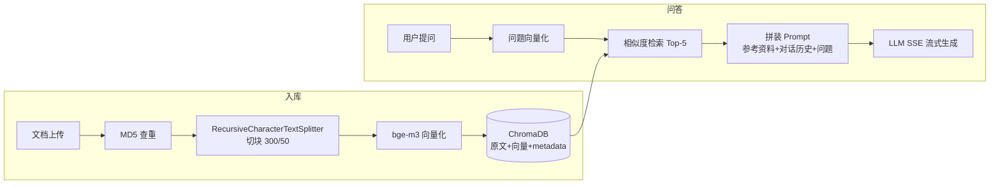

# 智能知识库问答系统（RAG）

基于 LangChain + ChromaDB 的知识库问答应用：上传文档自动入库，多轮对话问答，SSE 流式输出。以服装售前客服为示例场景（尺码推荐 / 洗涤养护 / 颜色选择），知识库内容可替换为任意领域。

## ✨ 功能特性

- **文档入库**：上传文本文档 → 自动切块（chunk_size=300 / overlap=50）→ 向量化 → 存入 ChromaDB，MD5 去重防止重复录入，上传记录同步 Django 数据库
- **语义检索**：用户问题向量化后与知识库比对余弦相似度，召回 Top-K 相关片段
- **SSE 流式输出**：回答逐 token 渲染，首个文本块到达即开始显示；流式帧用 JSON 包装，避免文本内换行破坏帧分隔
- **多轮对话 + 历史恢复**：按 session_id 隔离、持久化对话历史，刷新页面自动恢复
- **会话管理**：左侧抽屉列出全部历史会话（标题自动取首条提问），点击切换、单条删除，并记住上次使用的会话
- **知识库统计**：向量块数 / 入库文档数 / 最近入库时间实时可见
- **工程化分层**：静态前端 → FastAPI 路由 → 服务层（线程安全单例）→ 存储层（Chroma / SQLite / JSON 文件）

## 📐 架构演进

| 版本 | 形态 | 说明 |
|---|---|---|
| v0.1 | Streamlit 单文件原型 | 快速验证 RAG 链路可行性 |
| v0.2 | Django + FastAPI 工程化 | 服务层单例、Swagger 文档、Django Admin、静态前端 |
| v0.3（当前） | 原型退役，结构收敛 | 移除双实现分叉、修复 bug、前端补齐流式与历史恢复（见下方优化记录） |

保留"先原型、后工程化、再收敛"的演进路径，而不是一开始就上重架构。

## 🏗️ 架构



## 🛠️ 技术栈

| 层 | 技术 |
|---|---|
| 编排 | LangChain（LCEL 链、RunnableWithMessageHistory） |
| 向量库 | ChromaDB（本地持久化） |
| 模型 | BAAI/bge-m3（Embedding）+ DeepSeek（Chat），经 SiliconFlow API 调用 |
| 后端 | FastAPI（挂载于 Django ASGI 之下，共享 Admin 与 ORM） |
| 前端 | 原生 HTML/CSS/JS 静态页（手写设计系统，无框架依赖） |

## 🚀 快速开始

```bash
# 1. 安装依赖
pip install -r requirements.txt

# 2. 配置密钥（SiliconFlow 平台申请，设为环境变量）
#    Windows: setx OPENAI_API_KEY "你的密钥"   （重开终端生效）
#    Linux/Mac: export OPENAI_API_KEY="你的密钥"

# 3. 初始化数据库并启动
python manage.py migrate
python manage.py createsuperuser   # 可选：Django Admin 管理员
python run.py --port 8000
# 落地页:    http://127.0.0.1:8000
# 聊天界面:  http://127.0.0.1:8000/api/chat
# 知识库:    http://127.0.0.1:8000/api/upload
# API 文档:  http://127.0.0.1:8000/api/docs
```

## 📁 目录结构

```
├── config_data.py               # 全局配置（路径/chunk/模型/检索 k 值，统一管理）
├── file_history_store.py        # 对话历史持久化（按 session 分 JSON 文件）
├── apps/
│   ├── api/                     # FastAPI 路由与 Schema
│   │   ├── routers/qa.py        #   问答（ask / SSE stream / history）
│   │   └── routers/knowledge.py #   知识库（上传 / 统计）
│   └── core/                    # Django app
│       ├── models.py            #   KnowledgeDocument 上传记录
│       └── services/            #   服务层（RAG / 知识库 / 向量库，线程安全单例）
├── static/                      # 前端三页（落地 / 对话 / 知识库管理）
├── data/                        # 示例知识库文档
├── rag_project/                 # Django + FastAPI 组合 ASGI 配置
└── run.py                       # 启动脚本
```

## 🔧 优化记录（2026-09）

| 类别 | 改动 | 动机 / 收益 |
|---|---|---|
| 架构 | 移除 Streamlit 原型与根目录三对重复实现 | 双实现已出现修一分叉漏一方的维护隐患，收敛为单一实现 |
| fix | `/api/info` 路由前缀重复（实际暴露为 `/api/api/info`） | 接口地址与自描述一致 |
| fix | CORS `allow_origins=["*"]` + `allow_credentials=True` 无效组合 | 通配符源禁止携带凭证，去掉无效开关 |
| perf | prompt 只携带 `source` 元数据（原为整个 metadata 字典） | 省 token，去除与回答无关的入库时间/操作者噪声 |
| 协议 | 上传服务返回 `{status, chunks, message}` 结构化结果 | 原先路由层用中文前缀（"[成功]"）字符串判定状态，且两个端点标准不一致 |
| 命名 | `similarity_threshold` → `retrieval_top_k` | 原命名与语义不符（实为 top-k 数量而非相似度阈值） |
| 健壮性 | 运行时路径（md5/chroma_db/chat_history）基于 `BASE_DIR` 绝对化 | 原相对路径依赖启动目录，从别处启动会在错误位置新建空库 |
| 健壮性 | 四处裸 `except` 补警告日志 | Django 写库、历史读写失败不再静默吞错 |
| 清理 | 退役无人写入的 ChatSession/ChatMessage 空壳模型（迁移下线）；删除死代码 | 历史实际走 JSON 文件，模型自创建起无任何写入 |
| feat | 聊天页接入 SSE 流式输出 | 后端流式接口早已实现，前端一直没用；逐 token 渲染显著改善体验 |
| feat | 页面加载 / 切换会话时恢复对话历史 | 后端按 session 持久化了历史，此前刷新即丢 |
| feat | 知识库统计真实化（块数 / 文档数 / 最近入库） | 原先只显示集合名 "rag"，信息量为零 |
| feat | 会话列表：抽屉侧栏 + `GET /qa/sessions` 摘要接口 | 切换会话原先靠手动编辑输入框；清空改为删文件，列表随之消失 |
| feat | 知识库添加改版为 Dify 式三步向导（数据源 → 分段与清洗 → 处理完成） | 分段参数（长度/重叠/标识符/清洗）从配置文件搬进 UI，实时分段预览（`POST /knowledge/preview` 纯切块零成本）；上传时参数生效；推荐值 300/50 由 chunk 实验数据背书 |
| fix | SSE 流式帧 JSON 包装 | 文本内含换行符会破坏 `data:` 帧分隔，导致前端解析错乱 |
| 安全 | session_id 正则白名单校验（存储层 + 路由层双重） | session_id 直接拼进文件路径，`../xx` 可路径穿越写到目录外 |
| style | 字体本地化、按钮文字化、统计卡三列化、favicon | Google Fonts 国内加载失败回退宋体；裸图标按钮语义不明 |
| 实验 | chunk 参数扫描两轮：首轮 hit@1 25%~69%（后证实测于损坏的向量空间，参数敏感性亦为伪信号）；嵌入修复后重跑（服装语料）：**6 组配置全部 hit@1 100% / MRR 1.000**，英文模型对照 75% | 嵌入质量优先于调参的直接证据；报告见 experiments/results.md |
| fix | 嵌入修复：langchain_openai 默认把文本转成 tiktoken token id 再发给第三方接口，bge-m3 词表不同导致向量语义损坏（同文本与直连 API 余弦仅 0.29）——三处嵌入器统一关闭 check_embedding_ctx_length，上传端改为复用检索端嵌入器 | 检索从"时好时坏"（正确块被挤出 Top-5）到全配置满分；三角验证定位（embed_query / embed_documents / 直连 API 互证） |

## 🔬 后续计划

| 事项 | 说明 |
|---|---|
| chunk 实验扩充 | ✅ 两轮完成：嵌入修复前（25%~69%，损坏向量空间）+ 修复后全配置 100%；换域副本（AI 面试八股库语料）为 94%，甜区 88%~94% |
| 评估集扩充 | 已建 16 题评估集（experiments/chunk_experiment.py，含大量换述题）；计划扩至 30+ 题 |
| 英文嵌入模型对照 | ✅ 已补测：bge-large-en-v1.5 hit@1 75% vs bge-m3 100%（服装语料）、81% vs 94%（八股语料），印证中文语料应选中文嵌入模型 |
| 引用溯源 | 回答标注引用的来源文档（metadata 的 source 已就位） |
| LangGraph 迁移 | RunnableWithMessageHistory 已被 LangChain 标记弃用，计划迁移至 LangGraph persistence |
| 部署上线 | Docker 化 + 免费托管（HF Spaces / Render 等） |

## 📝 说明

- `chat_history/`、`chroma_db/`、`md5.text` 等运行时数据不入库（见 .gitignore），克隆后按"快速开始"重建
- 密钥仅通过环境变量 `OPENAI_API_KEY` 提供，不进入代码与仓库
